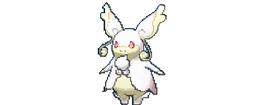

# ▸ Programming Paradigms Lab ✿

---

## ▸ Conteúdo ✿

### [Relatórios da disciplina](exercicios-da-disciplina/)

Relatórios e resoluções das atividades propostas na disciplina **Paradigmas da Programação - S01**, organizados conforme as atividades realizadas ao longo do semestre.

* [Relatório 01](exercicios-da-disciplina/relatorio-01-basic)
* [Relatório 02](exercicios-da-disciplina/relatorio-02-lua)
* [Relatório 03](exercicios-da-disciplina/relatorio-03-rust)
* [Relatório 04](exercicios-da-disciplina/relatorio-04-go)
* [Relatório 05](exercicios-da-disciplina/relatorio-05-c++)

> Novos relatórios serão adicionados conforme as atividades da disciplina forem realizadas.

---